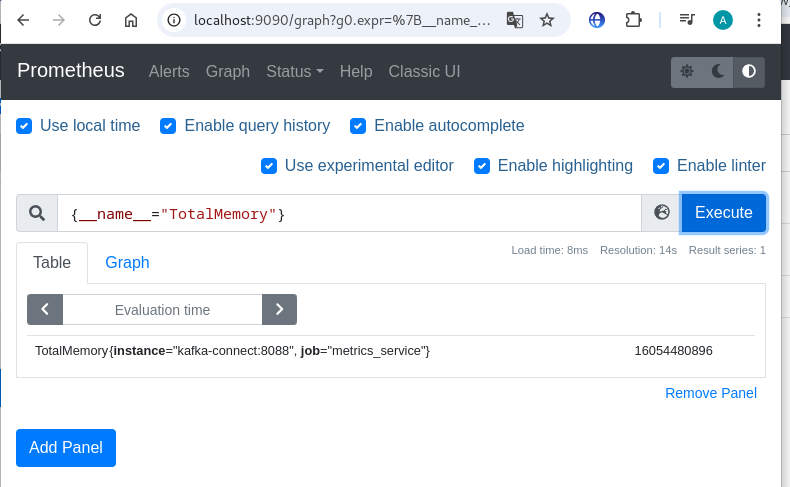

# Kafka Самостоятельная работа №3
## Задание 2. Создание собственного коннектора для переноса данных из Apache Kafka в Prometheus

### 1) Описание проекта:
* В папке *"hw3_task2"* находиться java код собственного коннектора;
* В папке *"confluent-hub-components"* находиться jar файл собственного конектора.

### 2) Запуск проекта и настрока коннектора в дирректории `/task_2/infra_template_task_2`:
####  Запускаем проект командой:
```
docker compose up -d
```
#### После запуска проекта, проверяме успешность запуска коннектора командой:
```
curl localhost:8083/connector-plugins | jq
```
#### Должен вернуться ответ следующего вида:
```
[
  {
    "class": "ru.yandex.hw3_task2.PrometheusSinkConnector",
    "type": "sink",
    "version": "1.0.0"
  },
  {
    "class": "org.apache.kafka.connect.mirror.MirrorCheckpointConnector",
    "type": "source",
    "version": "3.9.0"
  },
  {
    "class": "org.apache.kafka.connect.mirror.MirrorHeartbeatConnector",
    "type": "source",
    "version": "3.9.0"
  },
  {
    "class": "org.apache.kafka.connect.mirror.MirrorSourceConnector",
    "type": "source",
    "version": "3.9.0"
  }
]
```
#### Настраиваем коннектор PrometheusSinkConnector, для этого в терминале вводим следующую команду:
```
curl -X PUT \
-H "Content-Type: application/json" \
--data '{
"name": "prometheus-connector",
"connector.class": "ru.yandex.hw3_task2.PrometheusSinkConnector",
"tasks.max": "1",
"prometheus.listener.path": "/metrics",
"prometheus.listener.port": "8088",
"topics": "metrics-topic",
"key.converter": "org.apache.kafka.connect.storage.StringConverter",
"value.converter": "org.apache.kafka.connect.storage.StringConverter"
}' \
http://localhost:8083/connectors/prometheus-connector/config | jq
```
#### Чтобы проверить успешность настройки коннектора, в консоли вводим следующую команду:
```
curl http://localhost:8083/connectors/prometheus-connector/status | jq
```
#### Должен вернуться ответ слудующего вида:
```
{
  "name": "prometheus-connector",
  "connector": {
    "state": "RUNNING",
    "worker_id": "localhost:8083"
  },
  "tasks": [
    {
      "id": 0,
      "state": "RUNNING",
      "worker_id": "localhost:8083"
    }
  ],
  "type": "sink"
}
```
#### В брокере создастся топик *"metrics-topic"*
### 3) Проверка работы и результат:
#### В топик *"metrics-topic"* [ui-kafka](http://localhost:8085) вставить следующее сообщение:
```
{
  "Alloc": {
    "Type": "gauge",
    "Name": "Alloc",
    "Description": "Alloc is bytes of allocated heap objects.",
    "Value": 24293912
  },
  "FreeMemory": {
    "Type": "gauge",
    "Name": "FreeMemory",
    "Description": "RAM available for programs to allocate",
    "Value": 7740977152
  },
  "PollCount": {
    "Type": "counter",
    "Name": "PollCount",
    "Description": "PollCount is quantity of metrics collection iteration.",
    "Value": 3
  },
  "TotalMemory": {
    "Type": "gauge",
    "Name": "TotalMemory",
    "Description": "Total amount of RAM on this system",
    "Value": 16054480896
  }
}
```
#### В [Prometheus](http://localhost:9090) выполнить следующий запрос:
```
{__name__="TotalMemory"}
```
#### Результат запроса:

